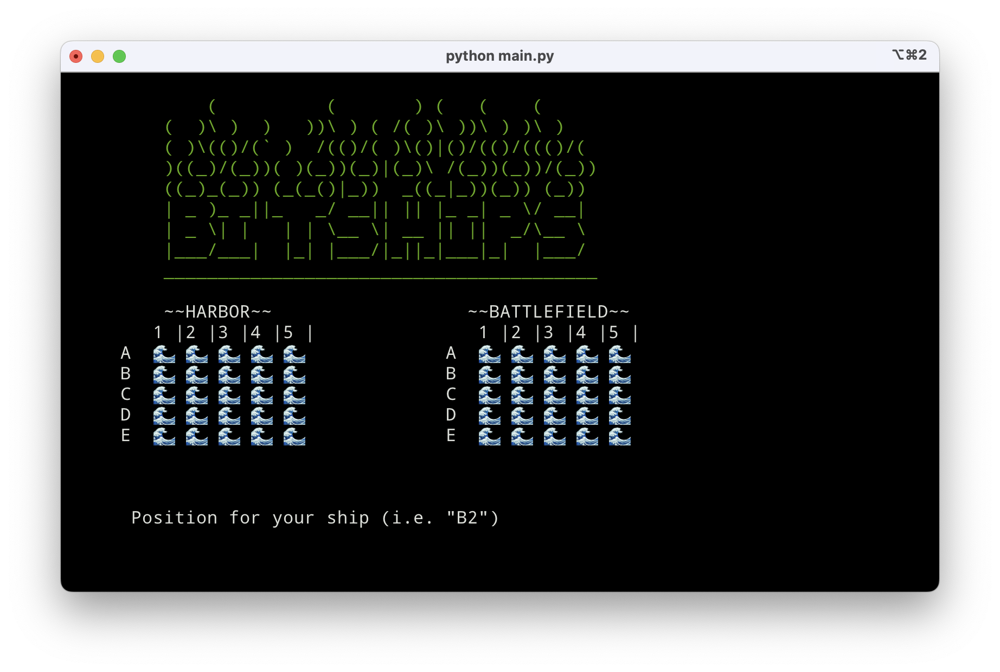
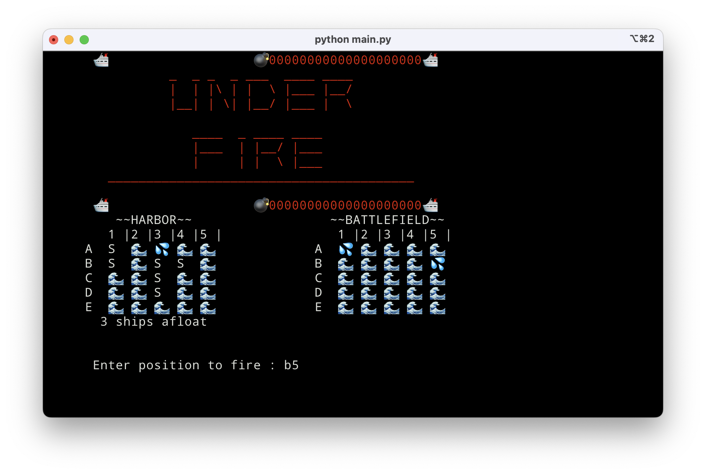
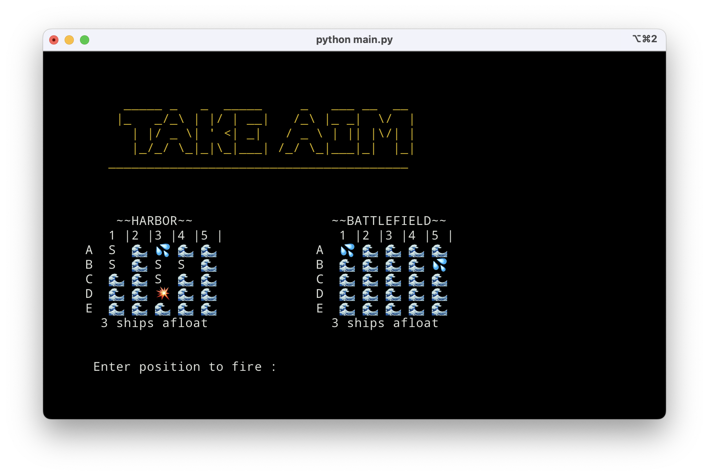
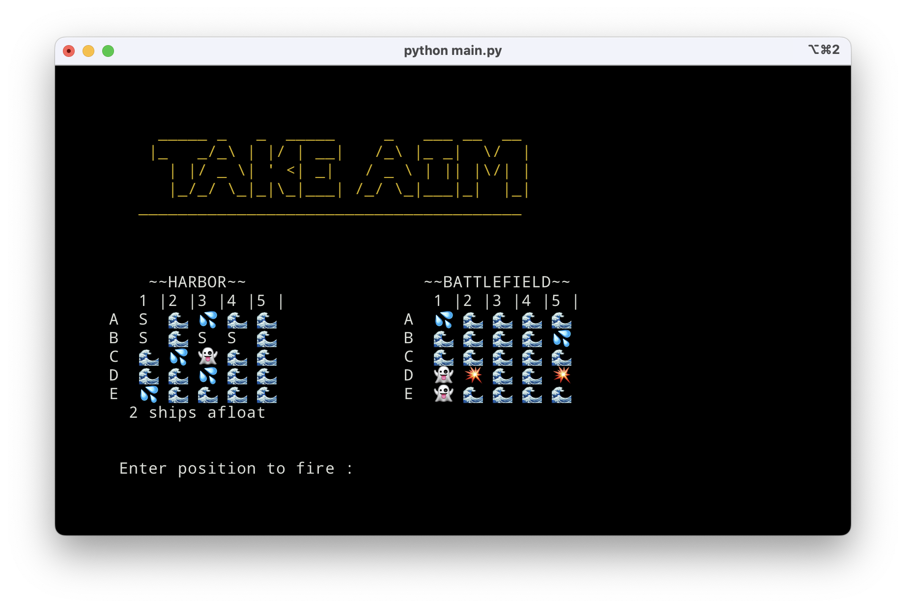

# ~~Battleship~~ BitShips

A command-line implementation of the classic Mattel game, using Python, the `curses` library, emojis and ASCII art.

## Installation

To play BitShips, clone this repository and then run `python lib/main.py` from the repository directory.

**Note** _To activate the ~~cheat~~ debug mode, enter `xx` at the coordinate prompt to turn on X-ray vision and see the computer's ships._ 😎

## Implementation

A `Game` class instance is created to store the game score and order player turns.

`Grid` class instances are created for the player and the computer to store the state of their individual game boards. Additional methods validate initial ship positioning, and confirm hits or misses.

The `Window` class provides a wrapper of the `curses` terminal rendering library, exposing the core functionality as class methods.

## Future Goals

- Support multiple ship sizes (1x3, 1x4, 1x5)
- Improve computer play logic (currently randomized shots)
